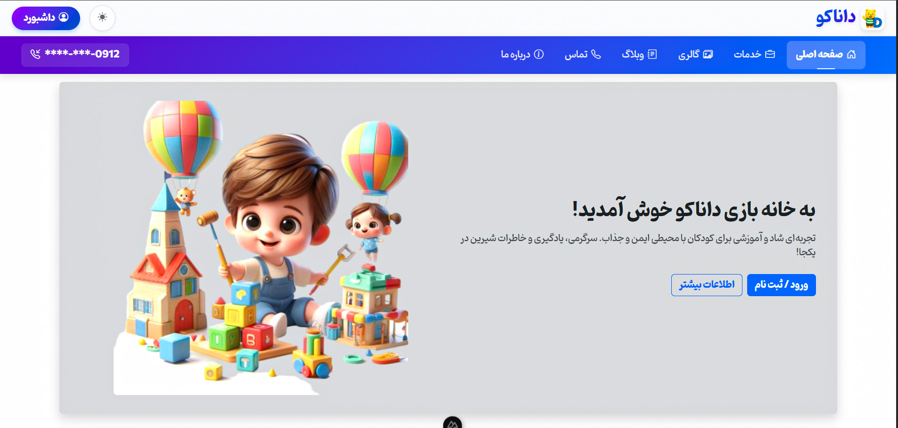
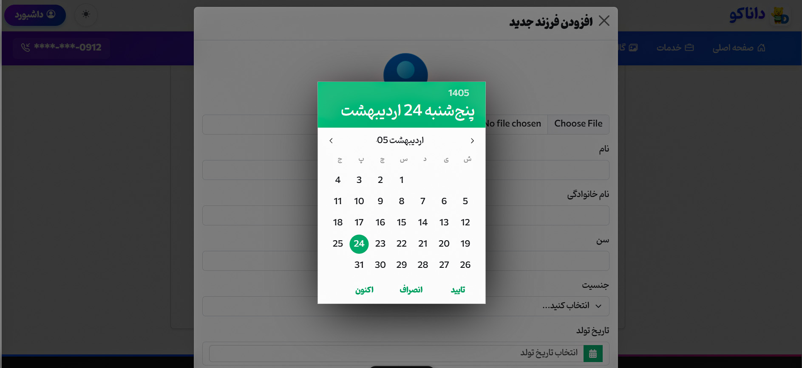

# Nuxt.js Danaco Website 🎡

A modern, interactive website for an amusement park built with **Nuxt.js**. This project features smooth animations, dynamic ticket booking, and engaging attractions to bring the park’s excitement online, all wrapped in a sleek purple-blue gradient UI.

## Preview 📸

| Home Page | Add Children |
|:---:|:---:|
|  |  |

| Responsive
|:---:|
| 

---

## Tech Stack 🛠️

- **Framework:** Nuxt.js (v4.x) - SSR (Server-Side Rendering)
- **Styling:** Bootstrap 5 & Bootstrap Icons
- **State Management:** Pinia
- **Form Validation:** Vee-Validate & Yup
- **UI Components:** Vue 3
- **Utility:** Vue3 Persian Datetime Picker (for date selection)
- **Design:** Responsive UI with Dark Theme capabilities

## Key Features ✨

### 🌐 General Pages
- **Home:** Interactive landing page with smooth animations.
- **Services:** Overview of park facilities and attractions.
- **Gallery:** Categorized photo gallery for park highlights.
- **Blog:** Full-featured blog with categories and article details.
- **About & Contact:** Information and inquiry forms.

### 🔐 Authentication System
- Secure Login & Registration.
- Form validation using **Vee-Validate** and **Yup**.
- Modern user experience with error handling.

### 👤 User Panel (Comprehensive)
- **Profile Management:** Edit personal info and change password.
- **Digital Wallet:** Manage credits and balance.
- **Activity History:** Track past bookings and interactions.
- **Family Management:** Feature to add and manage children profiles.
- **Rewards:** Access to points earned and active coupons.
- **Messaging:** Internal inbox for system notifications and messages.

### 💬 Interactive Elements
- Dynamic commenting system for blog posts.
- Category-based filtering for both gallery and blog.
- Fully responsive design (Mobile First).
- Smooth transitions and purple-blue gradient theme.

## Project Structure 📂

```bash
assets/          # Styles (SCSS/CSS), Images, Fonts
components/      # Reusable Vue components
layouts/         # Page layouts (Default, UserPanel, etc.)
pages/           # Nuxt routes and views
plugins/         # Third-party integrations
store/           # Pinia stores for state management
public/          # Static assets
```

## Installation 📥

Clone the repository:

```bash
git clone https://github.com/your-username/nuxtjs-danaco-website.git
cd nuxtjs-danaco-website
```

Install dependencies using **Yarn** (recommended):

```bash
yarn install
```

## Running the Project ▶️

Start the development server:

```bash
yarn dev
```

Build for production:

```bash
yarn build
```

The application will be available at `http://localhost:3000`.

## Main Dependencies 📚

- `nuxt`: ^4.1.2
- `@pinia/nuxt`: ^0.11.2
- `bootstrap`: ^5.3.8
- `vee-validate`: ^4.15.1
- `yup`: ^1.7.1
- `vue3-persian-datetime-picker`: ^1.2.2

## Purpose of the Project 🎯

This repository was developed as a practice project to master **Nuxt.js SSR** capabilities, complex state management with **Pinia**, and building advanced user interfaces with **Bootstrap 5**.

## License 📄

This project is open for learning and experimentation.